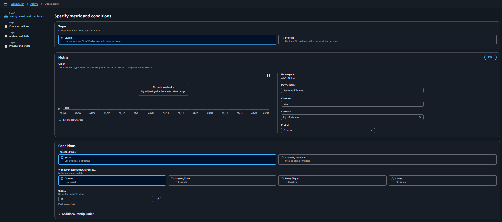
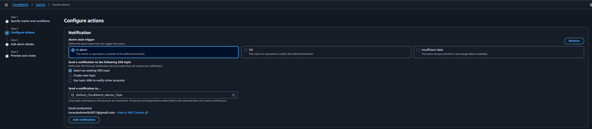
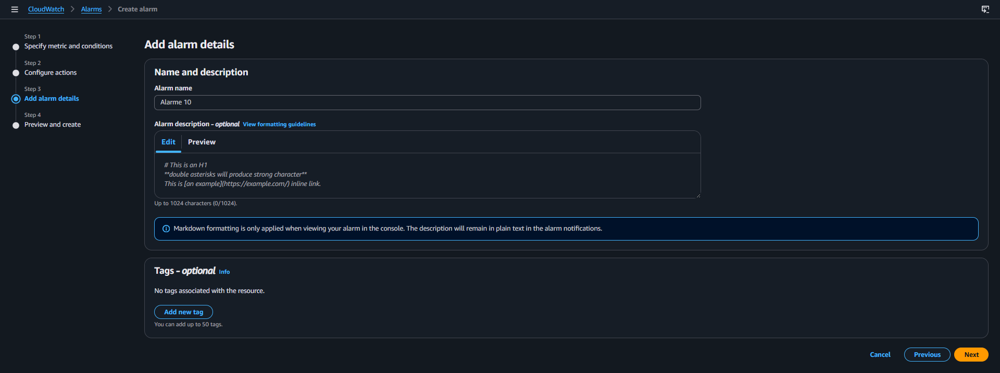
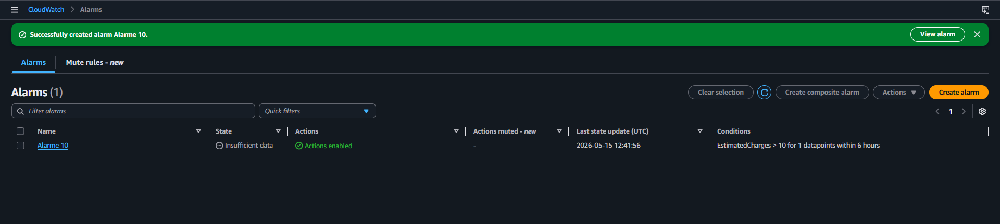

# AWS Billing Alarm Lab

## Sobre o laboratório

Neste laboratório foi configurado um monitoramento de custos na AWS utilizando Amazon CloudWatch integrado ao Amazon SNS para envio automático de notificações por e-mail quando o valor estimado de cobranças da conta ultrapassar um limite definido.

O objetivo deste laboratório foi compreender conceitos de observabilidade, monitoramento financeiro e automação de alertas em ambientes Cloud.

---

# Serviços utilizados

- Amazon CloudWatch
- Amazon SNS (Simple Notification Service)
- AWS Billing Metrics

---

# Objetivos do laboratório

- Criar alarmes no CloudWatch
- Monitorar métricas de billing da AWS
- Configurar thresholds de custo
- Integrar notificações com SNS
- Receber alertas automáticos por e-mail
- Aplicar boas práticas de controle financeiro em Cloud

---

# Configuração realizada

| Configuração | Valor |
|---|---|
| Namespace | AWS/Billing |
| Métrica | EstimatedCharges |
| Estatística | Maximum |
| Período | 6 horas |
| Condição | Greater than |
| Threshold | 10 USD |
| Notificação | Amazon SNS |
| Canal | E-mail |

---

# Fluxo da arquitetura

```text
AWS Billing Metrics
        ↓
Amazon CloudWatch Alarm
        ↓
Amazon SNS Topic
        ↓
E-mail Notification
```

---

# Etapas executadas

## 1. Criação do Alarme no CloudWatch

- Seleção da métrica `EstimatedCharges`
- Configuração do limite de custo em `10 USD`
- Definição da condição de disparo do alerta

### Evidência



---

## 2. Configuração do SNS

- Criação/uso de um tópico SNS
- Associação do e-mail para recebimento das notificações
- Confirmação da inscrição via e-mail

### Evidência



---

## 3. Associação do SNS ao CloudWatch

- Vinculação do tópico SNS ao alarme
- Habilitação das ações automáticas do alarme

### Evidência



---

## 4. Validação do Alarme

- Verificação do estado do alarme
- Confirmação das ações habilitadas
- Monitoramento do status inicial `INSUFFICIENT_DATA`

### Evidência



---

# Conceitos praticados

- Cloud Financial Management
- Monitoramento de custos na AWS
- Observabilidade
- Threshold Alerts
- Event-driven notifications
- Integração entre serviços AWS

---

# Resultado

Alarme criado com sucesso no Amazon CloudWatch e integrado ao Amazon SNS para envio automático de notificações financeiras via e-mail.

---

# Skills demonstradas

- Amazon CloudWatch
- Amazon SNS
- AWS Billing Monitoring
- Cost Optimization
- Cloud Monitoring
- Alarm Management
- Observability Fundamentals

---

# Status

✅ Laboratório concluído


# Autor

Lucas

Analista de Suporte Pleno Nível 2  
Estudando AWS Cloud Computing e Infraestrutura Cloud.
