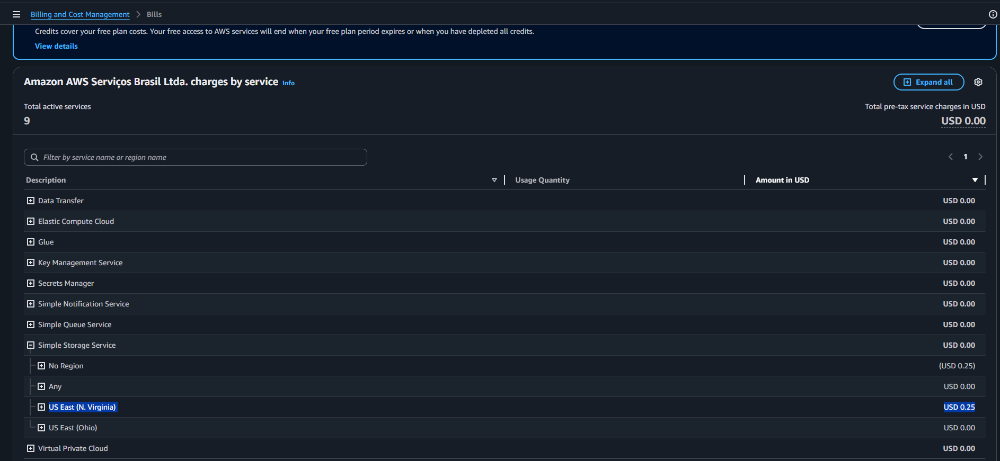
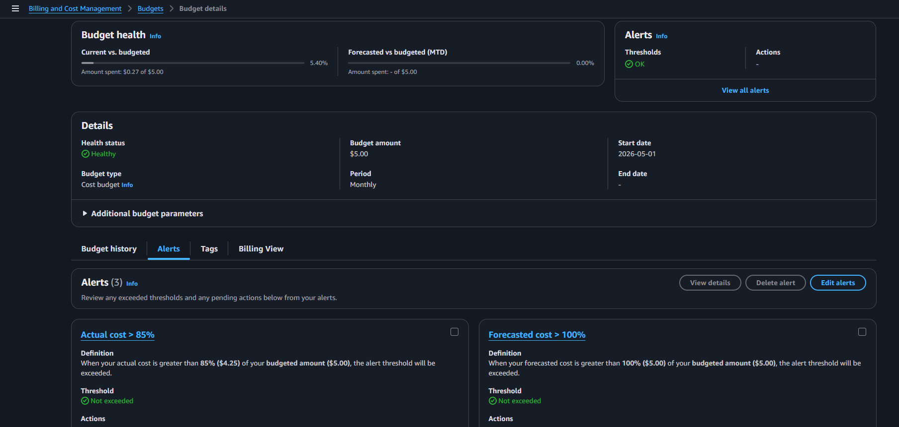

# AWS Budget and Billing Monitoring Lab

## Sobre o laboratório

Laboratório prático utilizando AWS Billing and Cost Management com foco em monitoramento de custos, configuração de budgets e análise de cobrança por serviços.

---

# Objetivo

Implementar controle financeiro básico na AWS utilizando Budgets, Billing Dashboard e alertas automáticos de custo.

---

# Serviços utilizados

- AWS Billing and Cost Management
- AWS Budgets
- Amazon S3
- Cost Monitoring

---

# Cenário do laboratório

## Budget criado

Monthly Cost Budget

## Valor definido

USD 5.00

## Tipo

Cost Budget

---

# Etapas realizadas

- Criação de Budget mensal
- Configuração de alertas de custo
- Monitoramento de Billing
- Análise de custos por serviço
- Identificação de cobrança do Amazon S3
- Verificação de regiões com consumo

---

# Alertas configurados

## Actual cost > 85%

Alerta configurado para notificar quando o custo real ultrapassar 85% do orçamento mensal.

---

## Actual cost > 100%

Alerta configurado para notificar quando o custo real ultrapassar o valor total do orçamento mensal.

---

## Forecasted cost > 100%

Alerta configurado para prever quando o custo estimado ultrapassar o orçamento definido.

---

# Análise de Billing

## Serviço com custo identificado

Amazon S3

## Região identificada

US East (N. Virginia)

## Valor identificado

USD 0.25

---

# Prints do laboratório

## AWS Bills por serviço

---

## AWS Budget Alerts

---

# Conceitos praticados

- AWS Budgets
- Billing Monitoring
- Cost Management
- Cost Alerts
- Cloud Financial Management
- Amazon S3 Billing
- Cost Explorer
- Cloud Governance

---

# Resultado

O laboratório validou com sucesso:

- criação de budget mensal
- configuração de alertas automáticos
- monitoramento de custos AWS
- identificação de serviços com cobrança
- análise básica de billing cloud

---

# Autor

Lucas

Analista de Suporte Pleno Nível 2  
Estudando AWS Cloud Computing e Infraestrutura Cloud.