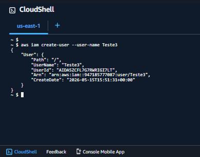
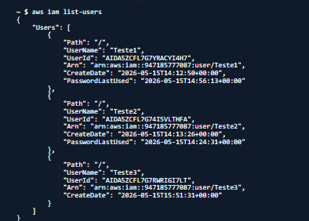

# AWS CLI IAM Lab

## Sobre o laboratório

Laboratório prático utilizando AWS CLI no AWS CloudShell para gerenciamento de usuários IAM via linha de comando.

O objetivo foi validar a administração de identidades AWS utilizando comandos CLI para automação e gerenciamento de usuários IAM.

---

# Serviços utilizados

- AWS CLI
- AWS CloudShell
- AWS IAM

---

# Conceitos praticados

- AWS CLI
- AWS CloudShell
- IAM User Management
- CLI Automation
- Identity Administration
- JSON Output
- Cloud Administration

---

# Objetivo do laboratório

Validar na prática:

- criação de usuários IAM via AWS CLI
- gerenciamento IAM utilizando linha de comando
- listagem de usuários IAM
- utilização do AWS CloudShell
- automação básica de administração AWS

---

# Comandos utilizados

## Criar usuário IAM

```bash
aws iam create-user --user-name Teste3
```

---

## Listar usuários IAM

```bash
aws iam list-users
```

---

# Evidências do laboratório

## Criação de usuário IAM via AWS CLI



---

## Listagem de usuários IAM via AWS CLI



---

# Resultados obtidos

- Usuário IAM criado utilizando AWS CLI
- Listagem de usuários validada
- AWS CloudShell utilizado com sucesso
- Administração IAM realizada via linha de comando
- Retorno JSON validado no console AWS

---

# Aprendizados

Este laboratório permitiu compreender na prática:

- utilização da AWS CLI
- gerenciamento IAM via terminal
- automação de tarefas administrativas AWS
- estrutura de resposta JSON da AWS CLI
- administração cloud utilizando linha de comando
- fundamentos de automação em ambientes AWS