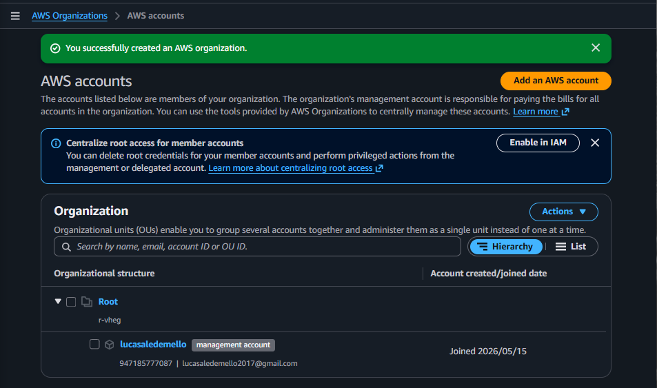
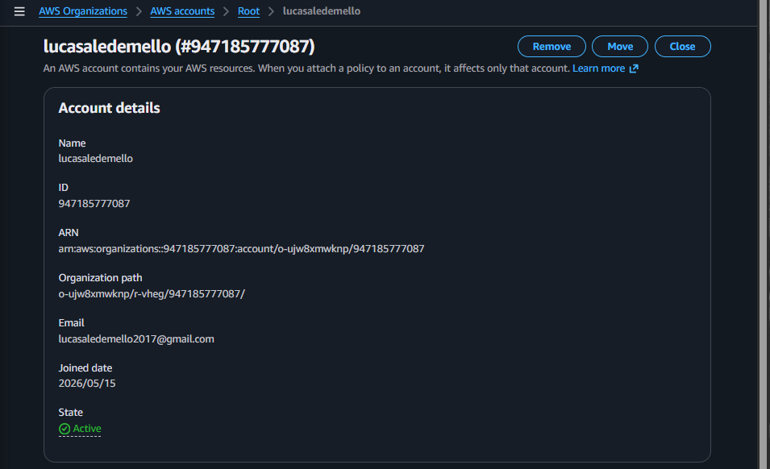

# AWS Organizations Lab

## Sobre o laboratório

Laboratório prático utilizando AWS Organizations para implementação de governança centralizada em ambiente AWS.

O objetivo foi habilitar uma organização AWS e compreender na prática o funcionamento da estrutura hierárquica utilizando uma Management Account.

---

# Serviços utilizados

- AWS Organizations
- AWS IAM

---

# Conceitos praticados

- AWS Organizations
- Management Account
- Root Organization
- Organizational Structure
- Cloud Governance
- Centralized Account Management

---

# Objetivo do laboratório

Validar na prática:

- habilitação do AWS Organizations
- criação da estrutura organizacional AWS
- gerenciamento centralizado de contas
- funcionamento da conta de gerenciamento
- estrutura hierárquica da organização

---

# Estrutura organizacional

| Componente | Descrição |
|---|---|
| Root | Estrutura principal da organização |
| Management Account | Conta responsável pela administração da organização |
| AWS Organizations | Serviço de gerenciamento centralizado de contas |

---

# Evidências do laboratório

## AWS Organization criada com sucesso

---

## Detalhes da conta organizacional

---

# Resultados obtidos

- AWS Organizations habilitado com sucesso
- Estrutura organizacional criada
- Conta principal configurada como management account
- Estrutura hierárquica validada
- Organização preparada para gerenciamento centralizado

---

# Aprendizados

Este laboratório permitiu compreender na prática:

- funcionamento do AWS Organizations
- conceito de management account
- gerenciamento centralizado de contas AWS
- estrutura organizacional em cloud
- fundamentos de cloud governance
- organização hierárquica em ambientes AWS