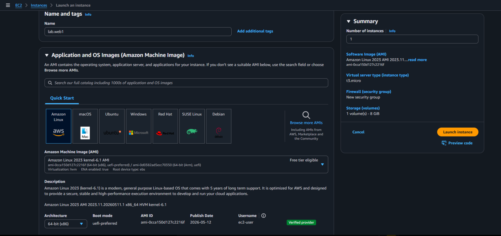
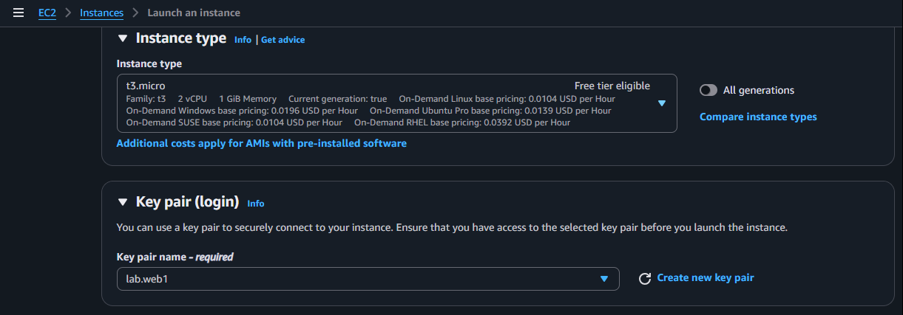
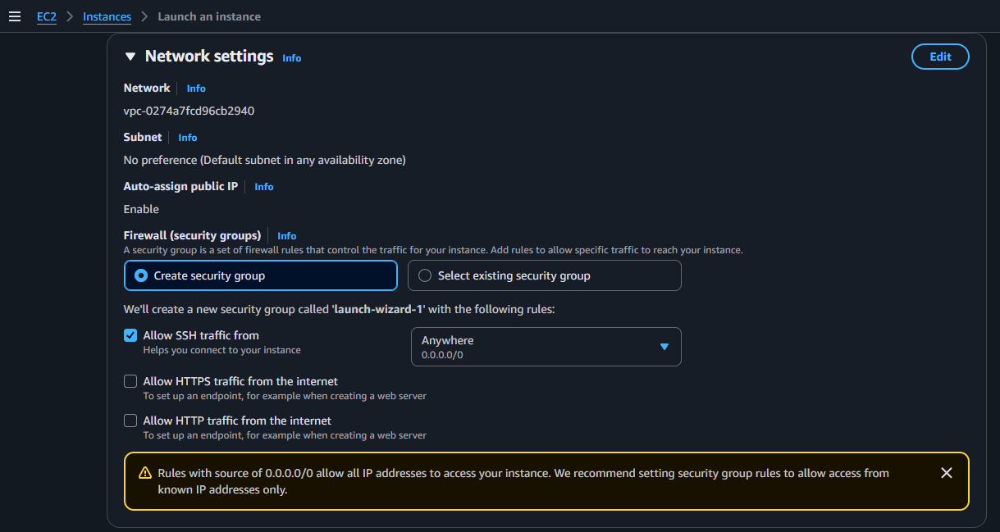
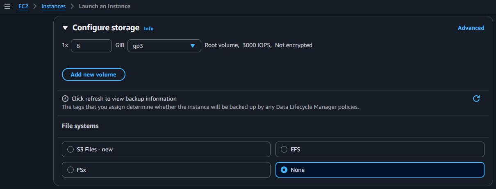
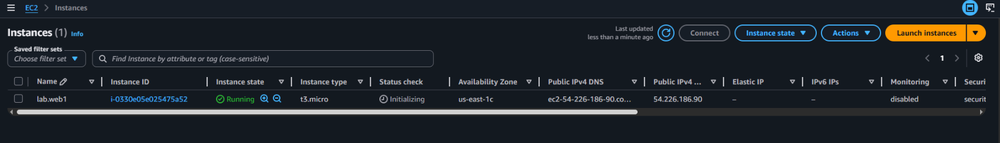
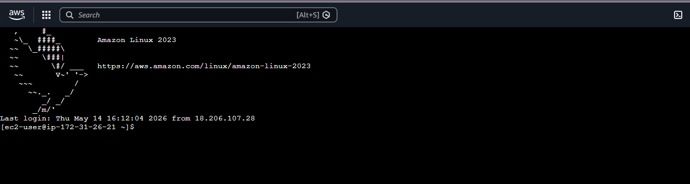
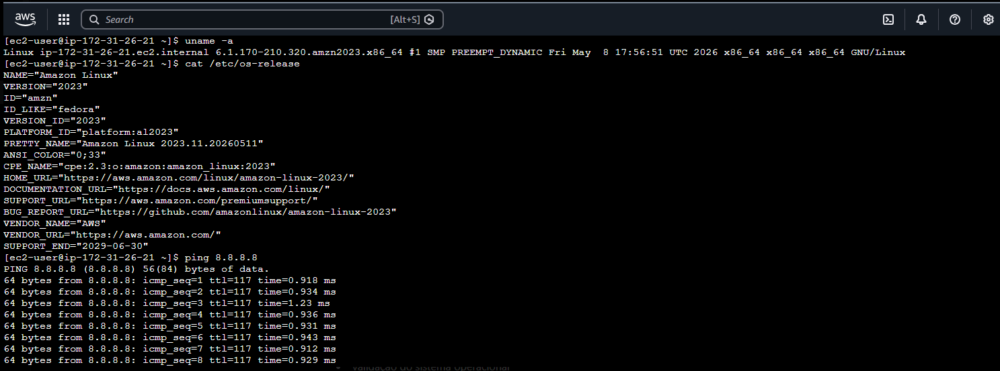
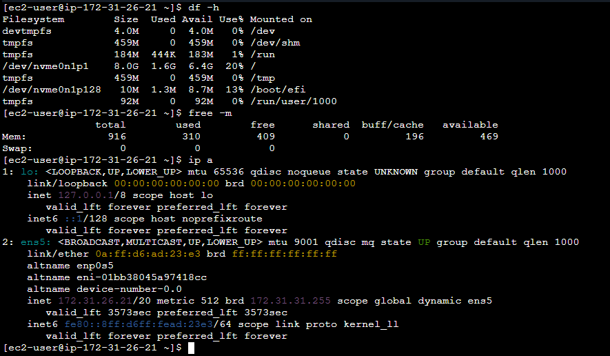

# AWS EC2 Linux Web Server Lab

## Sobre o laboratório

Laboratório prático utilizando Amazon EC2 com foco em provisionamento de instâncias Linux, configuração de rede, validação de conectividade e administração básica de sistemas Linux em ambiente AWS.

---

# Objetivo

Criar e validar uma instância EC2 Linux utilizando Amazon Linux 2023, explorando conceitos fundamentais de infraestrutura cloud, conectividade, armazenamento e networking.

---

# Serviços utilizados

- Amazon EC2
- Amazon EBS
- Security Groups
- EC2 Instance Connect
- Amazon VPC

---

# Cenário do laboratório

## Nome da instância

lab.web1

## Sistema operacional

Amazon Linux 2023 kernel-6.1 AMI

## Tipo da instância

t3.micro

## Região

us-east-1

## Availability Zone

us-east-1c

## Volume configurado

8 GiB gp3

---

# Etapas realizadas

- Criação da instância EC2
- Seleção da AMI Amazon Linux 2023
- Configuração do tipo t3.micro
- Configuração de Key Pair
- Configuração de Security Group
- Liberação de acesso SSH
- Configuração de armazenamento EBS gp3
- Inicialização da instância
- Conexão via EC2 Instance Connect
- Validação do sistema operacional
- Testes de conectividade de rede
- Validação de filesystem Linux
- Validação de memória RAM
- Inspeção de interfaces de rede

---

# Configurações utilizadas

## Security Group

- SSH liberado na porta 22
- Origem: 0.0.0.0/0

---

## Armazenamento

- Volume EBS gp3
- 8 GiB
- Root Volume

---

## Rede

- Public IPv4 habilitado
- IP privado interno AWS
- Interface de rede ens5

---

# Comandos executados

## Validação do sistema operacional

```bash
uname -a
```

```bash
cat /etc/os-release
```

---

## Teste de conectividade

```bash
ping 8.8.8.8
```

---

## Validação de armazenamento

```bash
df -h
```

---

## Validação de memória

```bash
free -m
```

---

## Inspeção de interfaces de rede

```bash
ip a
```

---

# Prints do laboratório

## Configuração inicial da instância



---

## Tipo da instância e Key Pair



---

## Configuração do Security Group



---

## Configuração de armazenamento



---

## Instância EC2 em execução



---

## Conexão via EC2 Instance Connect



---

## Validação do sistema operacional e conectividade



---

## Validação de filesystem, memória e rede



---

# Conceitos praticados

- Amazon EC2
- Linux Administration
- Amazon Linux 2023
- SSH Access
- Security Groups
- Public IP
- Private IP
- EBS Volumes
- Linux Filesystem
- Memory Validation
- Network Connectivity
- Linux Networking
- ICMP Validation
- EC2 Instance Connect
- Cloud Infrastructure
- Virtual Machines
- AWS Networking

---

# Resultado

O laboratório validou com sucesso:

- provisionamento de instância EC2
- configuração de acesso SSH
- conectividade de rede
- acesso ao sistema Linux
- validação operacional da instância
- funcionamento do armazenamento EBS
- inspeção de memória e interfaces de rede

---

# Autor

Lucas Mello

Analista de Suporte Pleno Nível 2  
Estudando Cloud Computing, Infraestrutura e Arquitetura AWS.