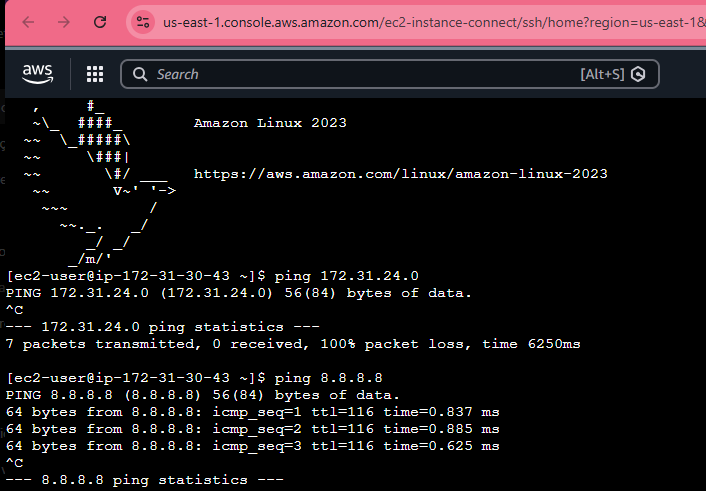
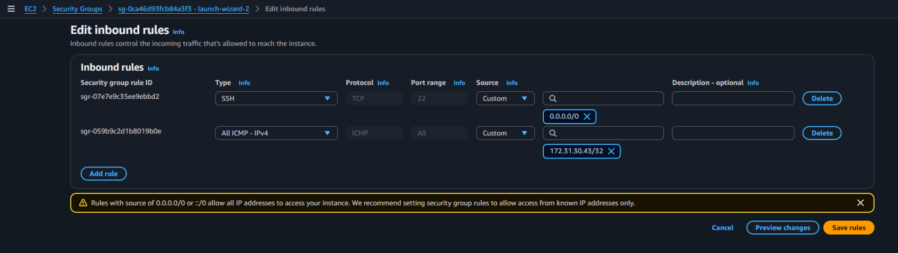
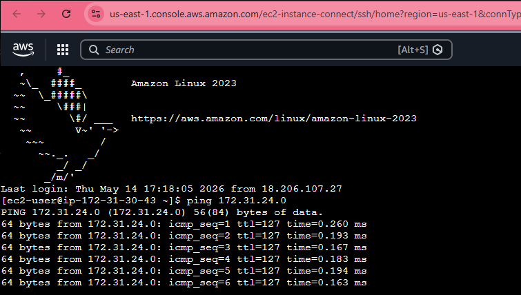

# AWS Security Groups Lab

## Objetivo

Demonstrar o funcionamento de Security Groups na AWS controlando tráfego ICMP entre instâncias EC2 dentro de uma VPC.

---

## Cenário

Foram criadas duas instâncias EC2:

- ServerA → 172.31.30.43
- ServerB → 172.31.24.0

Inicialmente, a comunicação ICMP entre as instâncias estava bloqueada devido à ausência de regras inbound apropriadas no Security Group da ServerB.

---

## Teste inicial

Durante o teste inicial, a ServerA não conseguia se comunicar com a ServerB utilizando ping.

Entretanto, a conectividade externa funcionava normalmente, validando que o problema estava relacionado ao controle de tráfego interno da VPC.

---

## Configuração realizada

Foi adicionada uma regra inbound no Security Group da ServerB permitindo tráfego ICMP apenas do IP privado da ServerA.

### Regra criada

- Type: All ICMP - IPv4
- Source: 172.31.30.43/32

---

## Resultado

Após a criação da regra ICMP no Security Group, a comunicação entre as instâncias foi estabelecida com sucesso.

---

## Conceitos praticados

- AWS EC2
- AWS VPC
- Security Groups
- ICMP
- Stateful Firewall
- Controle de tráfego inbound
- Troubleshooting de conectividade
- Comunicação entre instâncias EC2

---

## Conclusão

Este laboratório permitiu validar na prática o comportamento stateful dos Security Groups da AWS, demonstrando como regras inbound impactam diretamente a comunicação entre instâncias EC2 dentro de uma VPC.