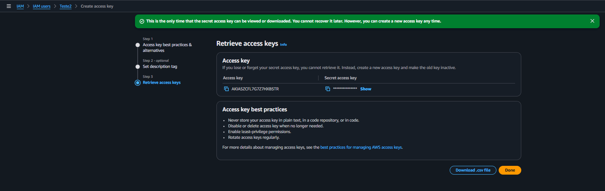
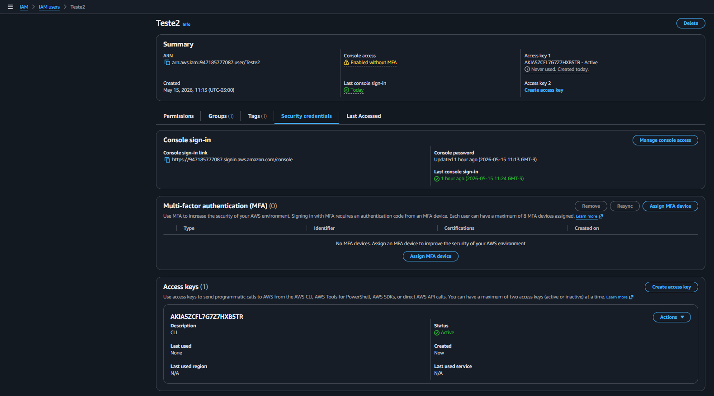

# AWS IAM Access Keys and SDK Lab

## Sobre o laboratório

Laboratório prático utilizando AWS IAM para criação e gerenciamento de Access Keys para acesso programático em ambientes AWS.

O objetivo foi validar a geração de credenciais programáticas para utilização em AWS CLI, SDKs e automações cloud.

---

# Serviços utilizados

- AWS IAM
- AWS Access Keys
- AWS SDK
- AWS CLI

---

# Conceitos praticados

- IAM Access Keys
- Programmatic Access
- AWS SDK
- AWS CLI Authentication
- Identity Security
- Access Management
- Cloud Administration

---

# Objetivo do laboratório

Validar na prática:

- criação de access keys IAM
- gerenciamento de credenciais programáticas
- autenticação programática AWS
- utilização de credenciais IAM
- fundamentos de integração com AWS SDK

---

# Recursos criados

| Recurso | Descrição |
|---|---|
| Access Key ID | Credencial pública de acesso programático |
| Secret Access Key | Chave secreta de autenticação |
| IAM User Teste2 | Usuário utilizado para autenticação programática |

---

# Evidências do laboratório

## Access Key criada com sucesso

---

## Access Key ativa no usuário IAM

---

# Resultados obtidos

- Credenciais programáticas criadas com sucesso
- Access Key vinculada ao usuário IAM
- Autenticação programática habilitada
- Estrutura preparada para integração com AWS CLI e SDKs
- Gerenciamento de credenciais IAM validado

---

# Aprendizados

Este laboratório permitiu compreender na prática:

- funcionamento de access keys AWS
- autenticação programática em cloud
- integração de IAM com AWS CLI e SDKs
- gerenciamento seguro de credenciais AWS
- fundamentos de automação e integração cloud