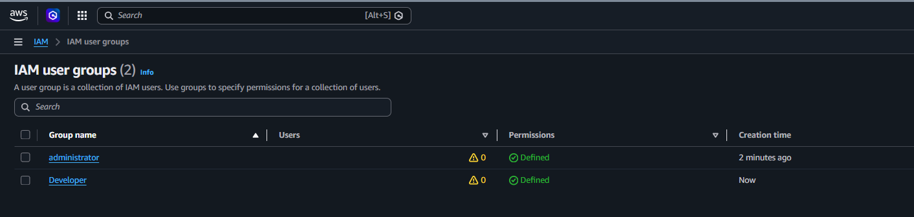
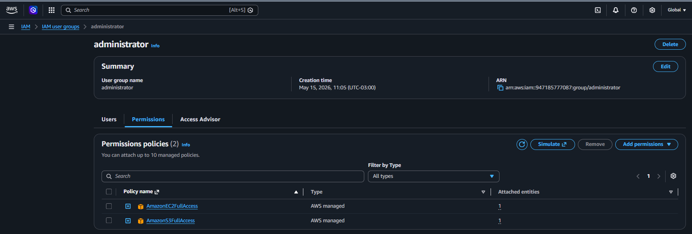
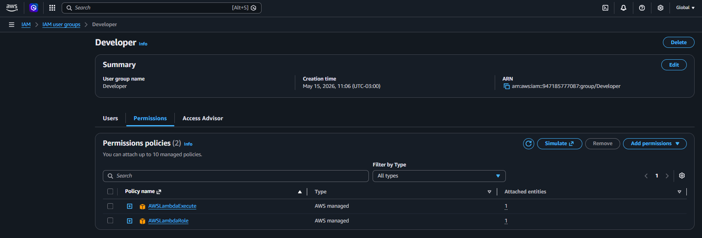
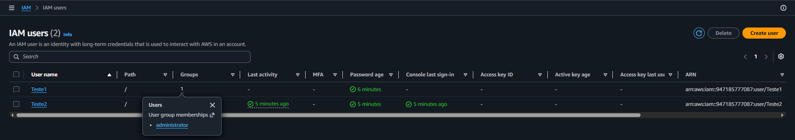
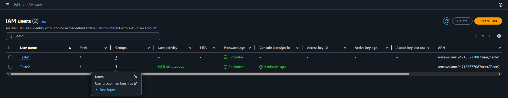
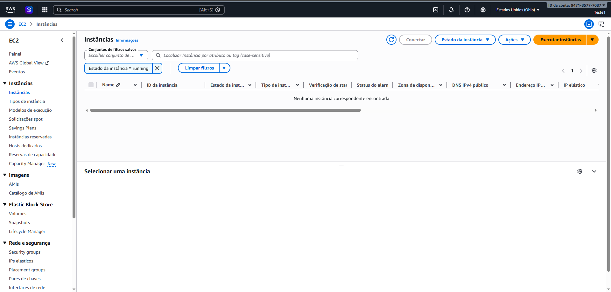
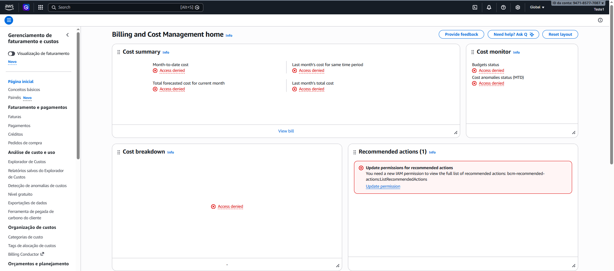
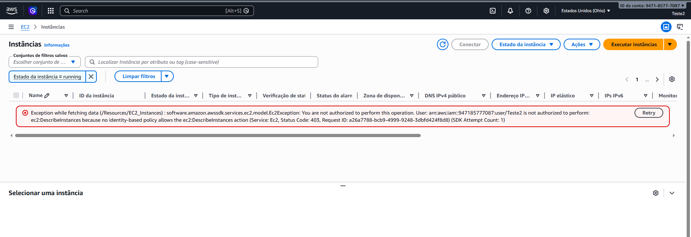

# AWS IAM Groups and Permission Management Lab

## Sobre o laboratório

Laboratório prático utilizando AWS IAM para gerenciamento de usuários, grupos e permissões baseado em RBAC (Role Based Access Control).

O objetivo foi validar na prática o funcionamento de permissões herdadas através de grupos IAM utilizando AWS Managed Policies.

---

# Serviços utilizados

- AWS IAM
- AWS EC2
- AWS Billing and Cost Management

---

# Recursos criados

## IAM Groups

- administrator
- Developer

---

## IAM Users

- Teste1
- Teste2

---

# Policies utilizadas

## Grupo administrator

- AmazonEC2FullAccess
- AmazonS3FullAccess

## Grupo Developer

- AWSLambdaExecute
- AWSLambdaRole

---

# Conceitos praticados

- IAM Users
- IAM Groups
- AWS Managed Policies
- Permission Management
- Access Control
- RBAC
- Least Privilege
- Permission Inheritance

---

# Estrutura de permissões

| Usuário | Grupo | Resultado |
|---|---|---|
| Teste1 | administrator | Acesso permitido ao EC2 |
| Teste1 | administrator | Acesso negado ao Billing |
| Teste2 | Developer | Acesso negado ao EC2 |

---

# Evidências do laboratório

## IAM Groups

---

## Policies do grupo administrator

---

## Policies do grupo Developer

---

## Usuário Teste1 criado e adicionado ao grupo administrator

---

## Usuário Teste2 criado e adicionado ao grupo Developer

---

## Teste1 acessando EC2

---

## Teste1 sem acesso ao Billing

---

## Teste2 sem acesso ao EC2

---

# Resultados obtidos

- Criação de grupos IAM com permissões específicas
- Associação de usuários aos grupos
- Herança automática de permissões
- Validação prática de acesso permitido e negado
- Implementação de segregação de acesso utilizando IAM

---

# Aprendizados

Este laboratório permitiu compreender na prática:

- como permissões são herdadas em grupos IAM
- diferença entre permissões administrativas e específicas
- funcionamento de políticas AWS Managed
- conceito de least privilege
- controle granular de acesso em ambientes AWS