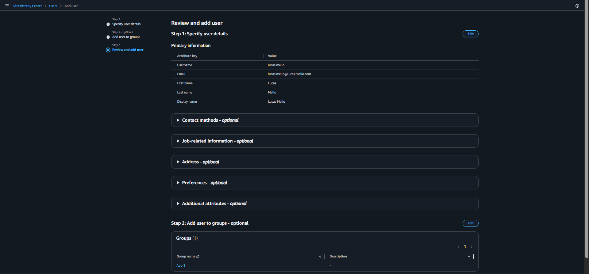

# AWS IAM Identity Center Lab

## Sobre o laboratório

Laboratório prático utilizando AWS IAM Identity Center para gerenciamento centralizado de identidades e acesso ao ambiente AWS.

O objetivo foi compreender o funcionamento do IAM Identity Center e validar o provisionamento de usuários para acesso centralizado ao portal AWS.

---

# Serviços utilizados

- AWS IAM Identity Center
- AWS IAM
- AWS Organizations

---

# Conceitos praticados

- IAM Identity Center
- Centralized Identity Management
- User Provisioning
- AWS Access Portal
- Access Management
- Cloud Governance
- Identity Administration

---

# Objetivo do laboratório

Validar na prática:

- criação de usuários no IAM Identity Center
- gerenciamento centralizado de identidades
- funcionamento do AWS Access Portal
- provisionamento de usuários
- gerenciamento de acesso centralizado

---

# Recursos criados

| Recurso | Descrição |
|---|---|
| lucas.mello | Usuário criado no IAM Identity Center |
| AWS Access Portal | Portal centralizado de acesso AWS |
| App 1 | Grupo atribuído ao usuário |

---

# Evidências do laboratório

## AWS Access Portal - Applications

---

## AWS Access Portal - Accounts

---

## Usuário criado no IAM Identity Center

---

## Revisão da criação do usuário

---

# Resultados obtidos

- IAM Identity Center habilitado com sucesso
- Usuário provisionado centralmente
- AWS Access Portal validado
- Estrutura de gerenciamento de identidade criada
- Gerenciamento centralizado de acesso implementado

---

# Aprendizados

Este laboratório permitiu compreender na prática:

- funcionamento do IAM Identity Center
- gerenciamento centralizado de usuários AWS
- fluxo de provisionamento de identidades
- conceito de access portal
- governança de acesso em cloud
- administração centralizada de identidades