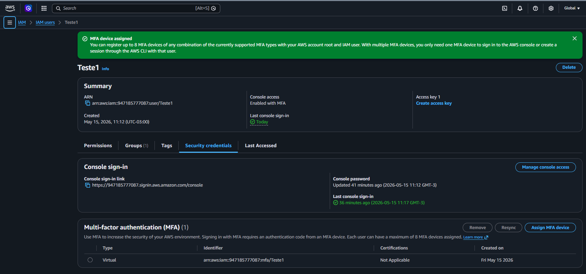
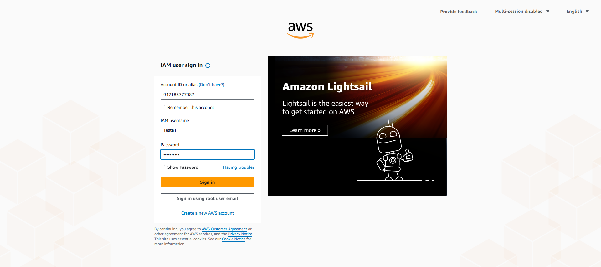
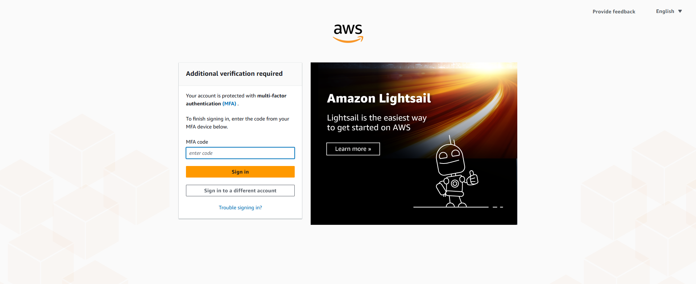
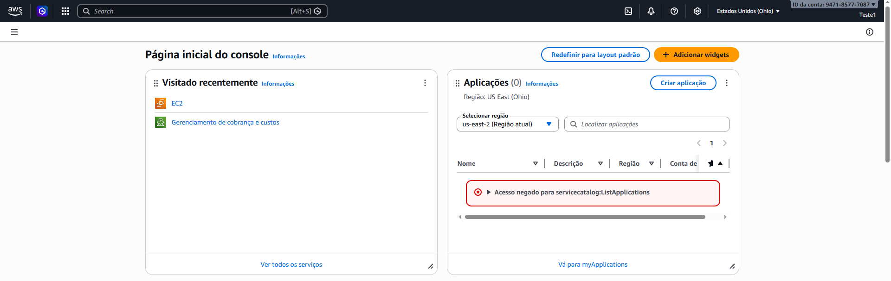

# AWS IAM MFA Security Lab

## Sobre o laboratório

Laboratório prático utilizando AWS IAM para implementação e validação de autenticação multifator (MFA) em usuários IAM.

O objetivo foi aumentar a segurança do acesso ao ambiente AWS utilizando MFA virtual com autenticação baseada em aplicativo autenticador.

---

# Serviços utilizados

- AWS IAM
- Multi-Factor Authentication (MFA)

---

# Recursos utilizados

## IAM User

- Teste1

---

# Conceitos praticados

- IAM Security
- Multi-Factor Authentication
- Access Protection
- Identity Validation
- AWS IAM Users
- Virtual MFA Device
- Secure Authentication

---

# Objetivo do laboratório

Validar na prática:

- criação de MFA virtual
- associação de MFA em usuário IAM
- login utilizando autenticação multifator
- proteção adicional de acesso ao console AWS

---

# Evidências do laboratório

## MFA habilitado no usuário IAM

---

## Login utilizando usuário IAM

---

## Solicitação de código MFA

---

## Login autenticado com sucesso utilizando MFA

---

# Resultados obtidos

- MFA virtual habilitado com sucesso
- Usuário IAM protegido com autenticação multifator
- Validação prática do fluxo de login MFA
- Implementação de camada adicional de segurança
- Redução de risco de acesso não autorizado

---

# Aprendizados

Este laboratório permitiu compreender na prática:

- funcionamento do MFA em usuários IAM
- fluxo de autenticação multifator na AWS
- importância de proteção adicional em identidades cloud
- boas práticas de segurança em ambientes AWS
- implementação de autenticação segura utilizando MFA virtual