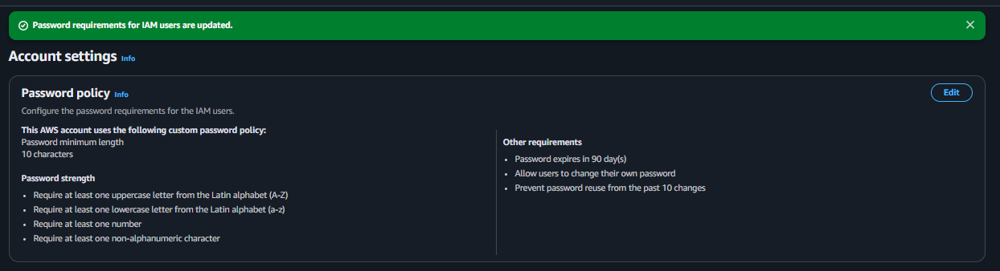

# AWS IAM Password Policy Lab

## Sobre o laboratório

Laboratório prático utilizando AWS IAM para configuração de políticas de senha em usuários IAM.

O objetivo foi implementar requisitos de segurança para autenticação de usuários no ambiente AWS utilizando Password Policy customizada.

---

# Serviços utilizados

- AWS IAM

---

# Conceitos praticados

- IAM Password Policy
- Password Security
- IAM Security
- Access Protection
- Authentication Security
- Cloud Governance
- Identity Security

---

# Objetivo do laboratório

Validar na prática:

- configuração de política de senha IAM
- requisitos mínimos de complexidade
- expiração automática de senha
- prevenção de reutilização de senhas
- fortalecimento de autenticação no ambiente AWS

---

# Configurações aplicadas

| Configuração | Status |
|---|---|
| Tamanho mínimo de senha | 10 caracteres |
| Letra maiúscula obrigatória | ✅ |
| Letra minúscula obrigatória | ✅ |
| Número obrigatório | ✅ |
| Caractere especial obrigatório | ✅ |
| Expiração automática | 90 dias |
| Permitir alteração de senha | ✅ |
| Bloqueio de reutilização | Últimas 10 senhas |

---

# Evidências do laboratório

## Password Policy configurada no IAM

---

# Resultados obtidos

- Password Policy customizada configurada
- Requisitos mínimos de segurança aplicados
- Política de expiração habilitada
- Reutilização de senhas bloqueada
- Fortalecimento da autenticação IAM implementado

---

# Aprendizados

Este laboratório permitiu compreender na prática:

- funcionamento de políticas de senha IAM
- fortalecimento de autenticação em cloud
- implementação de requisitos mínimos de segurança
- governança de identidade e acesso
- boas práticas de segurança AWS