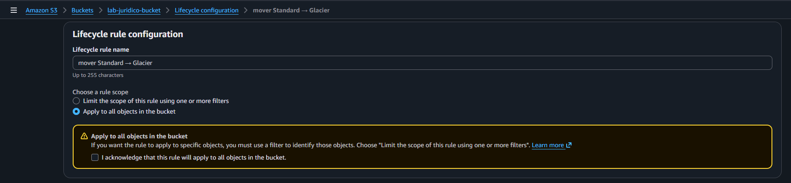
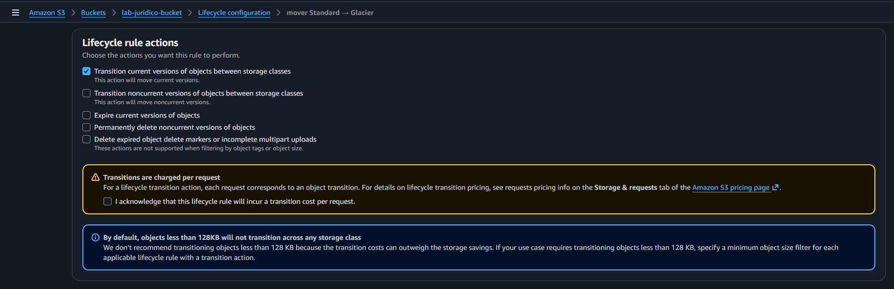
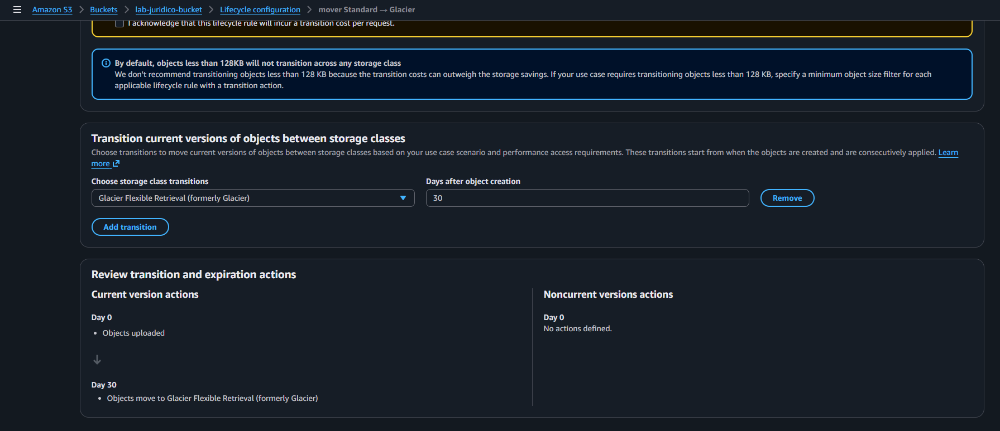
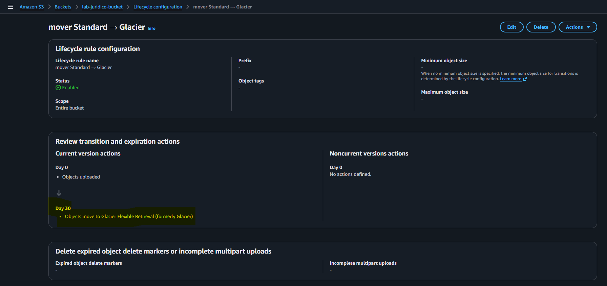

# AWS S3 Lifecycle Policy Lab

## Sobre o laboratório

Laboratório prático utilizando Amazon S3 com foco em gerenciamento automático do ciclo de vida de objetos através de Lifecycle Policies.

---

# Objetivo

Implementar automação de armazenamento utilizando regras de Lifecycle para transição automática de objetos entre classes de armazenamento da AWS.

---

# Serviços utilizados

- Amazon S3
- S3 Lifecycle Rules
- Glacier Flexible Retrieval
- Storage Classes

---

# Cenário do laboratório

## Bucket utilizada

lab-juridico-bucket

## Regra criada

Mover objetos da classe Standard para Glacier Flexible Retrieval após 30 dias.

## Região

us-east-1

---

# Etapas realizadas

- Criação da Lifecycle Rule
- Aplicação da regra para todos os objetos do bucket
- Configuração de transição automática
- Definição de transição após 30 dias
- Seleção da classe Glacier Flexible Retrieval
- Revisão das ações de ciclo de vida

---

# Prints do laboratório

## Criação da Lifecycle Rule



---

## Transition habilitada



---

## Configuração Glacier Flexible Retrieval após 30 dias



---

## Resumo da Lifecycle Policy



---

# Conceitos praticados

- Amazon S3
- Lifecycle Policies
- Storage Classes
- Glacier Flexible Retrieval
- Automação de armazenamento
- Redução de custos em cloud
- Data Lifecycle Management

---

# Resultado

O laboratório validou com sucesso:

- automação de ciclo de vida no S3
- transição automática entre storage classes
- gerenciamento inteligente de armazenamento
- otimização de custos utilizando Glacier

---

# Estrutura do laboratório

```txt
s3-lifecycle-policy-lab/
│
├── README.md
│
└── images/
    ├── 01-lifecycle-rule-created.png
    ├── 02-transition-enabled.png
    ├── 03-glacier-transition-30-days.png
    └── 04-lifecycle-policy-summary.png
```

---

# Autor

Lucas Mello

Analista de Suporte Pleno Nível 2  
Estudando AWS Cloud Computing e Infraestrutura Cloud.