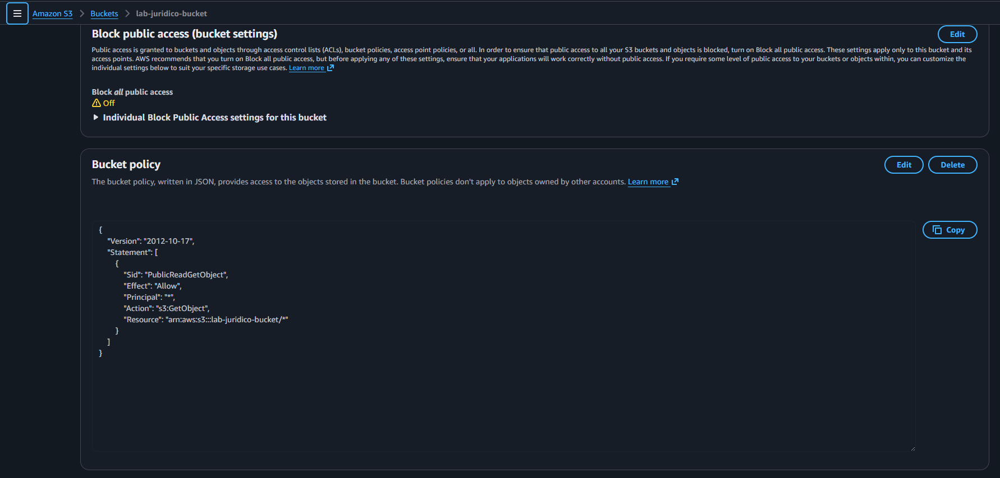
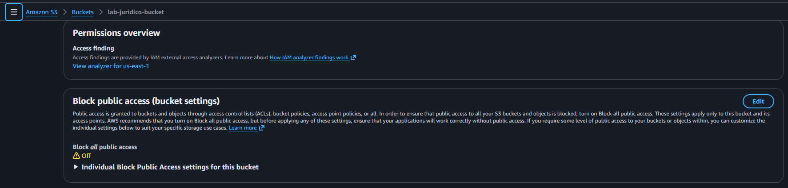
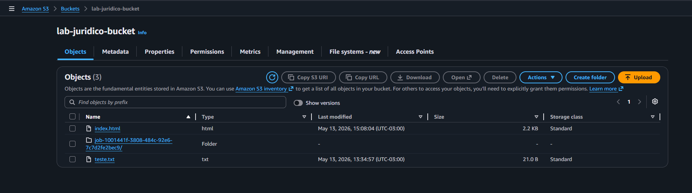
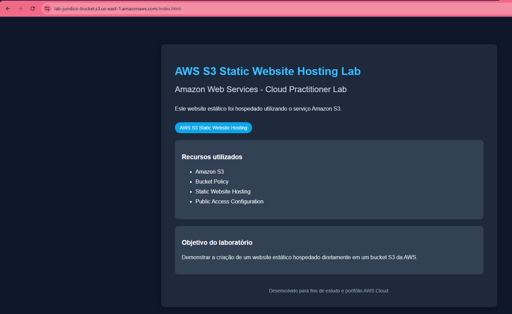

# AWS S3 Public Access Lab

## Sobre o laboratório

Laboratório prático utilizando Amazon S3 com foco em acesso público de objetos através de Bucket Policies.

---

# Objetivo

Permitir acesso público de leitura para objetos armazenados em um bucket Amazon S3 utilizando políticas de acesso.

---

# Serviços utilizados

* Amazon S3
* Bucket Policy
* Public Access Configuration

---

# Cenário do laboratório

## Bucket utilizada

lab-juridico-bucket

## Arquivo publicado

teste.txt

---

# Etapas realizadas

* Criação do bucket S3
* Upload do arquivo teste.txt
* Desativação do Block Public Access
* Configuração de Bucket Policy pública
* Liberação da permissão s3:GetObject
* Validação de acesso público via navegador

---

# Bucket Policy utilizada

```json
{
  "Version": "2012-10-17",
  "Statement": [
    {
      "Sid": "PublicReadGetObject",
      "Effect": "Allow",
      "Principal": "*",
      "Action": "s3:GetObject",
      "Resource": "arn:aws:s3:::lab-juridico-bucket/*"
    }
  ]
}
```

---

# Prints do laboratório

## Bucket Policy pública



---

## Block Public Access desabilitado



---

## Objetos armazenados no bucket



---

## Arquivo acessível publicamente



---

# Conceitos praticados

* Bucket Policy
* Public Access
* Object Storage
* Resource-Based Policies
* Amazon S3
* Public Object URL

---

# Resultado

O laboratório validou com sucesso:

* acesso público de leitura
* configuração de Bucket Policy
* disponibilização de arquivos via URL pública

---

# Autor

Lucas Mello

Analista de Suporte Pleno Nível 2
Estudando AWS Cloud Computing e Infraestrutura Cloud.
