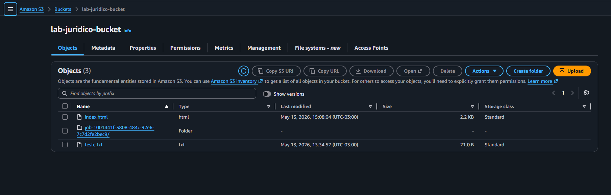
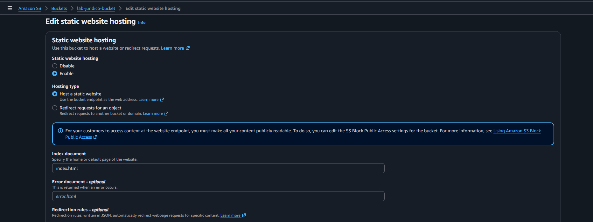
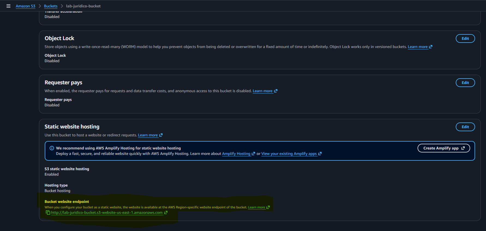
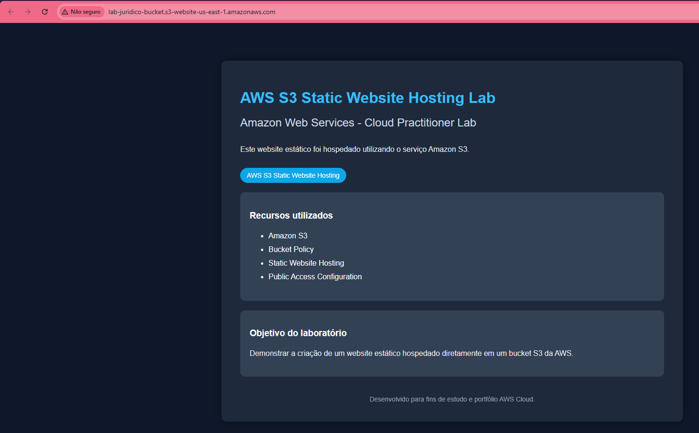

# AWS S3 Static Website Hosting Lab

## Sobre o laboratório

Laboratório prático utilizando Amazon S3 com foco em hospedagem de website estático utilizando o recurso Static Website Hosting.

---

# Objetivo

Publicar um website HTML estático diretamente em um bucket Amazon S3 utilizando endpoint público da AWS.

---

# Serviços utilizados

- Amazon S3
- Static Website Hosting
- Bucket Policy
- Public Access Configuration

---

# Cenário do laboratório

## Bucket utilizada

lab-juridico-bucket

## Arquivo publicado

index.html

## Região

us-east-1

---

# Etapas realizadas

- Criação do bucket S3
- Upload do arquivo index.html
- Configuração de acesso público
- Criação de Bucket Policy pública
- Habilitação do Static Website Hosting
- Definição do documento index
- Validação do endpoint do website

---

# Prints do laboratório

## Objeto index.html armazenado no bucket

---

## Static Website Hosting habilitado

---

## Endpoint do website gerado pela AWS

---

## Website funcionando no navegador

---

# Conceitos praticados

- Amazon S3
- Static Website Hosting
- Public Access
- Bucket Policy
- Website Endpoint
- Object Hosting
- Hospedagem estática em cloud

---

# Resultado

O laboratório validou com sucesso:

- hospedagem de website estático no Amazon S3
- publicação pública de arquivos HTML
- acesso via endpoint web da AWS
- configuração de Bucket Policy pública

# Autor

Lucas Mello

Analista de Suporte Pleno Nível 2
Estudando AWS Cloud Computing e Infraestrutura Cloud.
