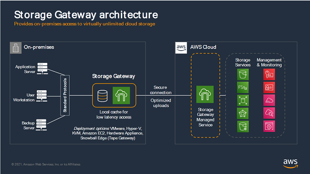
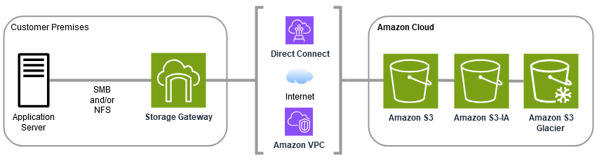
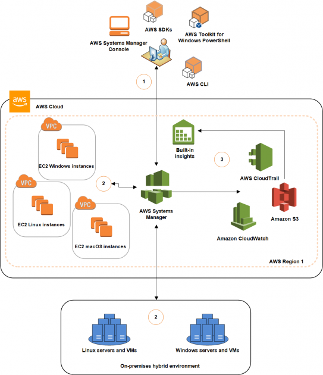
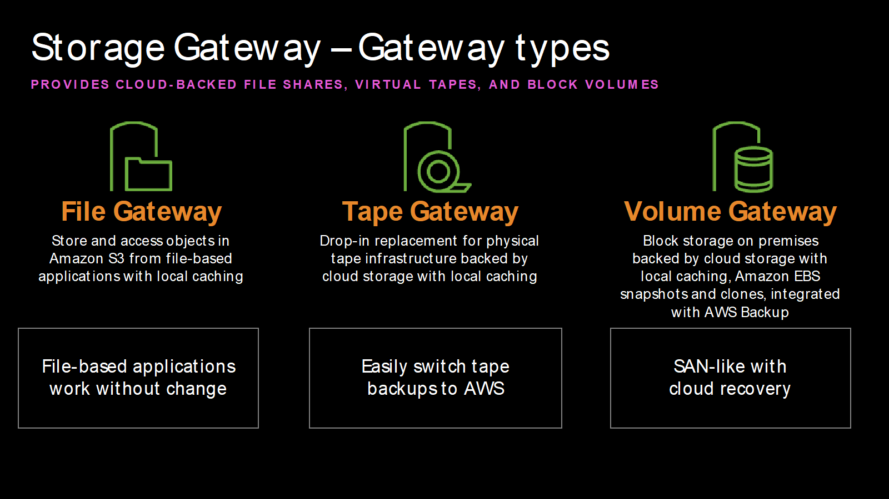

# AWS S3 Storage Gateway Lab

## Sobre o laboratório

Laboratório conceitual utilizando AWS Storage Gateway com foco em integração híbrida entre ambientes on-premises e AWS Cloud.

---

# Objetivo

Compreender os conceitos fundamentais do AWS Storage Gateway e os cenários corporativos de integração entre infraestrutura local e armazenamento em cloud.

---

# Serviços utilizados

- AWS Storage Gateway
- Amazon S3
- Hybrid Cloud
- File Gateway
- Volume Gateway
- Tape Gateway

---

# O que é AWS Storage Gateway

AWS Storage Gateway é um serviço híbrido que conecta ambientes locais (on-premises) aos serviços de armazenamento da AWS.

O serviço permite utilizar armazenamento em cloud mantendo integração com servidores locais e aplicações corporativas.

---

# Tipos de Storage Gateway

## File Gateway

Permite armazenar arquivos utilizando protocolos SMB e NFS integrados ao Amazon S3.

---

## Volume Gateway

Fornece armazenamento em bloco híbrido utilizando volumes conectados localmente com backup em cloud.

---

## Tape Gateway

Permite substituir bibliotecas físicas de fita por fitas virtuais armazenadas na AWS.

---

# Cenários de uso

- Backup corporativo
- Disaster Recovery
- Migração híbrida
- Armazenamento híbrido
- Arquivamento em cloud
- Integração entre datacenter e AWS

---

# Arquitetura do laboratório

## Visão geral do Storage Gateway



---

## Arquitetura File Gateway



---

## Fluxo Hybrid Cloud



---

## Tipos de Storage Gateway



---

# Conceitos praticados

- Hybrid Cloud
- AWS Storage Gateway
- Integração on-premises
- File Gateway
- Volume Gateway
- Tape Gateway
- Backup híbrido
- Arquitetura híbrida AWS

---

# Resultado

O laboratório permitiu compreender:

- integração entre infraestrutura local e AWS
- funcionamento do Storage Gateway
- cenários corporativos híbridos
- armazenamento enterprise em cloud

---

# Estrutura do laboratório

```txt
s3-storage-gateway-lab/
│
├── README.md
│
└── images/
    ├── 01-storage-gateway-overview.png
    ├── 02-file-gateway-architecture.png
    ├── 03-hybrid-cloud-flow.png
    └── 04-storage-gateway-types.png
```

---

# Autor

Lucas Mello

Analista de Suporte Pleno Nível 2  
Estudando AWS Cloud Computing e Infraestrutura Cloud.