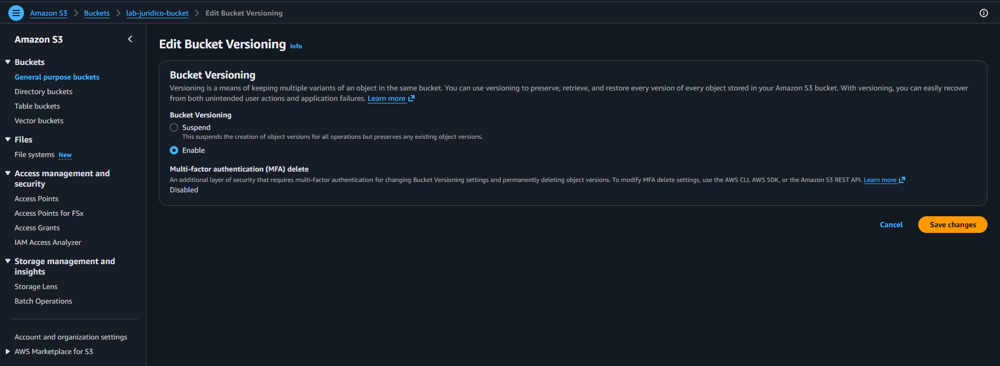
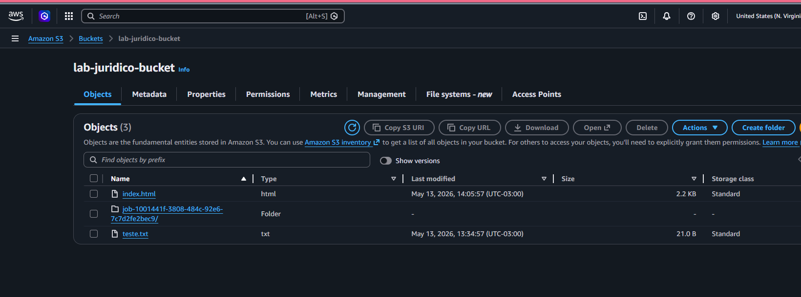
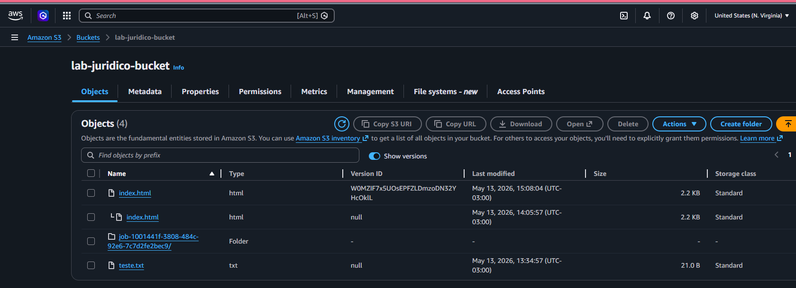
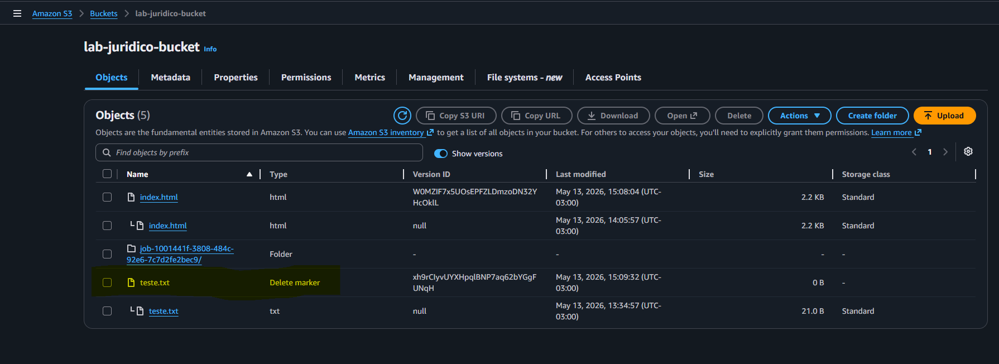
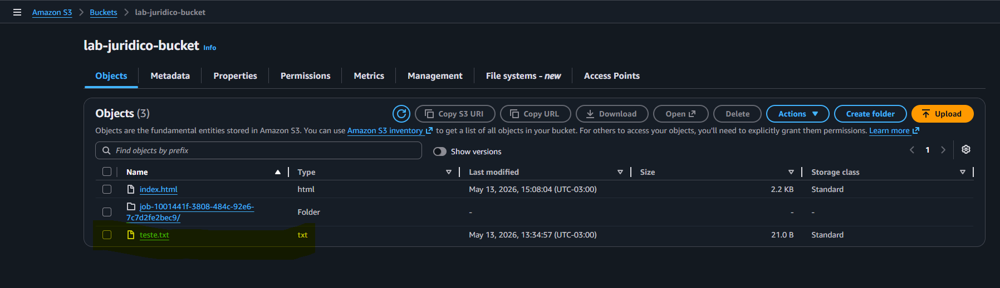
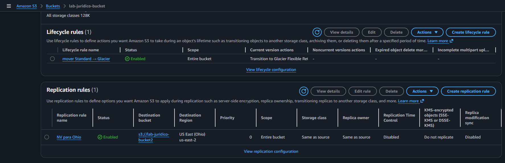
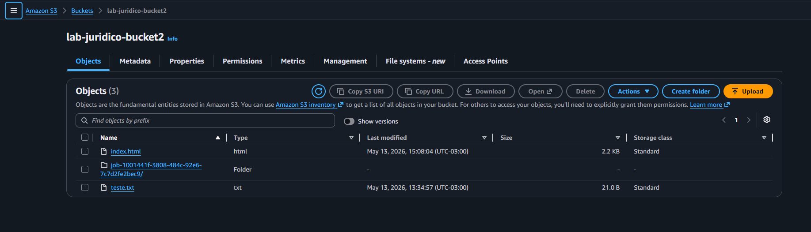

# AWS S3 Versioning and Replication Lab

## Sobre o laboratório

Laboratório prático utilizando Amazon S3 com foco em versionamento de objetos, recuperação de arquivos e replicação entre regiões AWS.

---

# Objetivo

Implementar recursos de proteção, recuperação e redundância utilizando funcionalidades nativas do Amazon S3.

---

# Serviços utilizados

* Amazon S3
* S3 Versioning
* S3 Cross-Region Replication (CRR)

---

# Cenário do laboratório

## Bucket origem

lab-juridico-bucket

## Bucket destino

lab-juridico-bucket2

## Região origem

us-east-1

## Região destino

us-east-2 (Ohio)

---

# Etapas realizadas

* Habilitação do Bucket Versioning
* Upload de objetos no bucket
* Exclusão do arquivo teste.txt
* Visualização do Delete Marker
* Recuperação do objeto removendo o Delete Marker
* Configuração de Cross-Region Replication
* Validação da replicação automática entre buckets

---

# Prints do laboratório

## Versionamento habilitado

---

## Objetos armazenados no bucket

---

## Visualização de versões dos objetos

---

## Delete Marker criado após exclusão

---

## Recuperação do objeto teste.txt

---

## Regra de replicação configurada

---

## Bucket destino com objetos replicados

---

# Conceitos praticados

* Bucket Versioning
* Delete Marker
* Object Recovery
* Cross-Region Replication (CRR)
* Disaster Recovery
* Redundância geográfica
* Proteção contra exclusão acidental

---

# Resultado

O laboratório validou com sucesso:

* recuperação de objetos utilizando versionamento
* replicação automática entre regiões AWS
* sincronização entre buckets S3

---

# Autor

Lucas Mello

Analista de Suporte Pleno Nível 2
Estudando AWS Cloud Computing e Infraestrutura Cloud.
