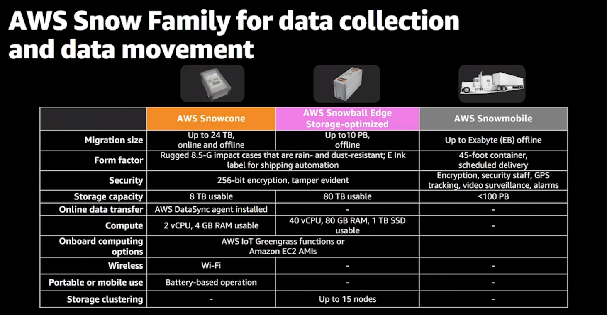
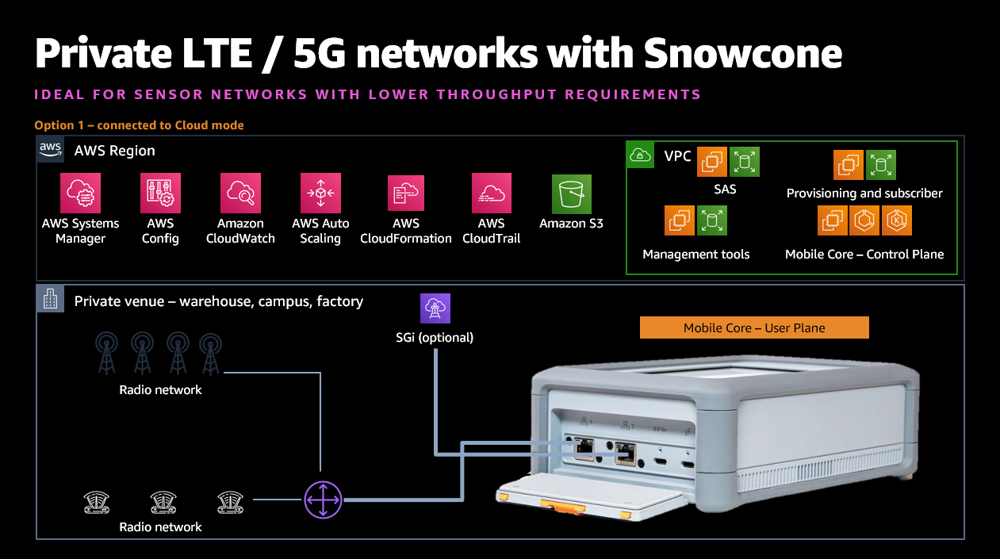
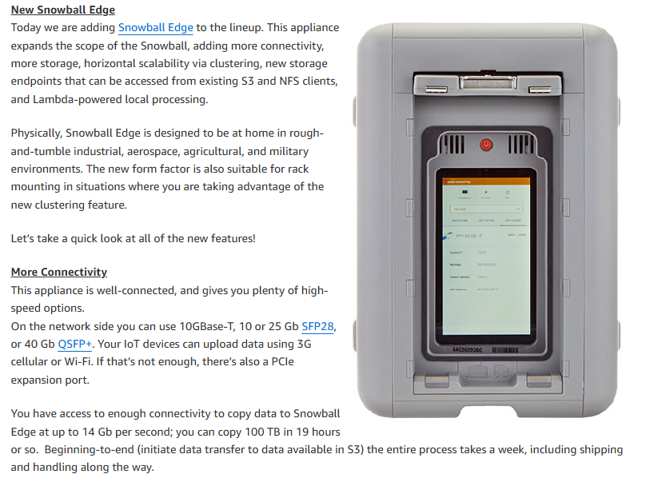
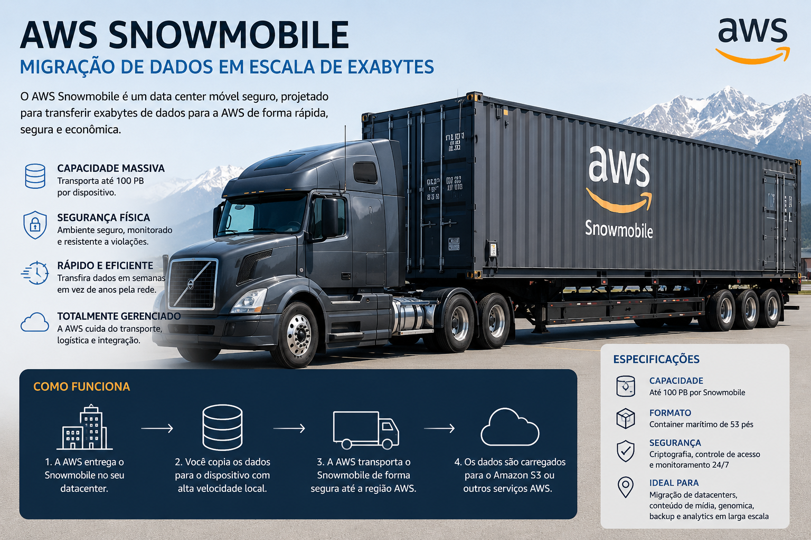

# AWS Snow Family Conceptual Lab

## Sobre o laboratório

Laboratório conceitual utilizando AWS Snow Family com foco em migração de dados, edge computing e transferência offline para AWS Cloud.

---

# Objetivo

Compreender os serviços da AWS Snow Family e seus cenários de uso em ambientes corporativos com grande volume de dados.

---

# Serviços utilizados

- AWS Snow Family
- AWS Snowcone
- AWS Snowball Edge
- AWS Snowmobile
- Amazon S3
- Edge Computing

---

# O que é AWS Snow Family

AWS Snow Family é um conjunto de dispositivos físicos utilizados para:

- migração de dados em larga escala
- processamento em edge computing
- transferência offline de dados para AWS

Esses dispositivos são utilizados quando:
- a rede é limitada
- o volume de dados é muito grande
- há necessidade de processamento local

---

# Componentes da Snow Family

## AWS Snowcone

Dispositivo portátil pequeno para edge computing e transferência de dados em ambientes remotos.

---

## AWS Snowball Edge

Dispositivo robusto utilizado para:

- migração de grandes volumes de dados
- processamento local
- edge computing corporativo

---

## AWS Snowmobile

Caminhão físico utilizado para migração de petabytes ou exabytes de dados para AWS.

---

# Cenários de uso

- migração de datacenters
- backup corporativo
- edge computing
- ambientes sem conectividade adequada
- transferência massiva de dados
- disaster recovery

---

# Arquitetura e dispositivos

## AWS Snow Family Overview



---

## AWS Snowcone



---

## AWS Snowball Edge



---

## AWS Snowmobile



---

# Conceitos praticados

- Edge Computing
- Offline Data Transfer
- Hybrid Cloud
- AWS Snow Family
- Data Migration
- Storage Migration
- Large Scale Transfer

---

# Resultado

O laboratório permitiu compreender:

- funcionamento da AWS Snow Family
- cenários de edge computing
- migração massiva de dados
- integração entre infraestrutura local e AWS Cloud

---

# Estrutura do laboratório

```txt
snow-family-conceptual-lab/
│
├── README.md
│
└── images/
    ├── 01-snow-family-overview.png
    ├── 02-snowcone.png
    ├── 03-snowball-edge.png
    └── 04-snowmobile.png
```

---

# Autor

Lucas Mello

Analista de Suporte Pleno Nível 2  
Estudando AWS Cloud Computing e Infraestrutura Cloud.